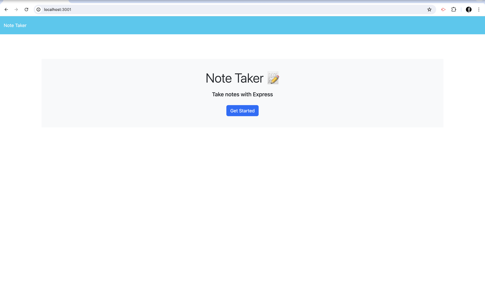
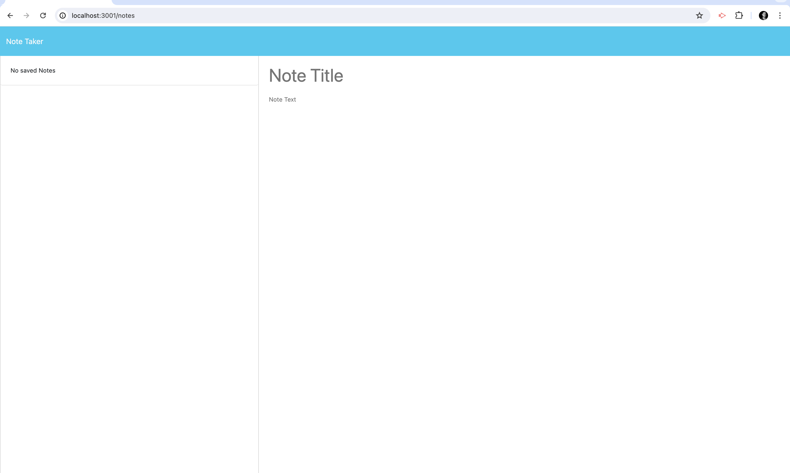
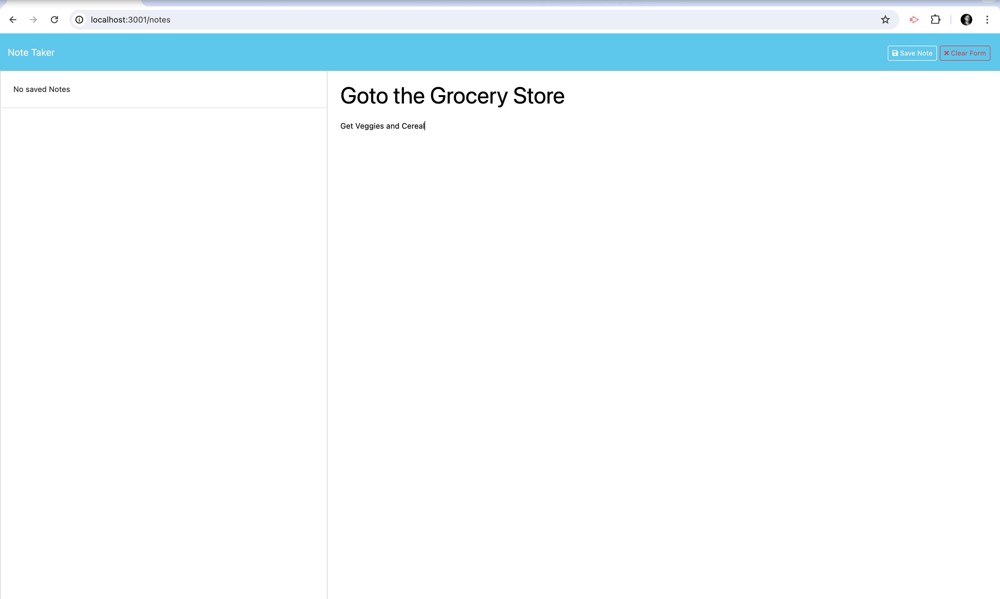
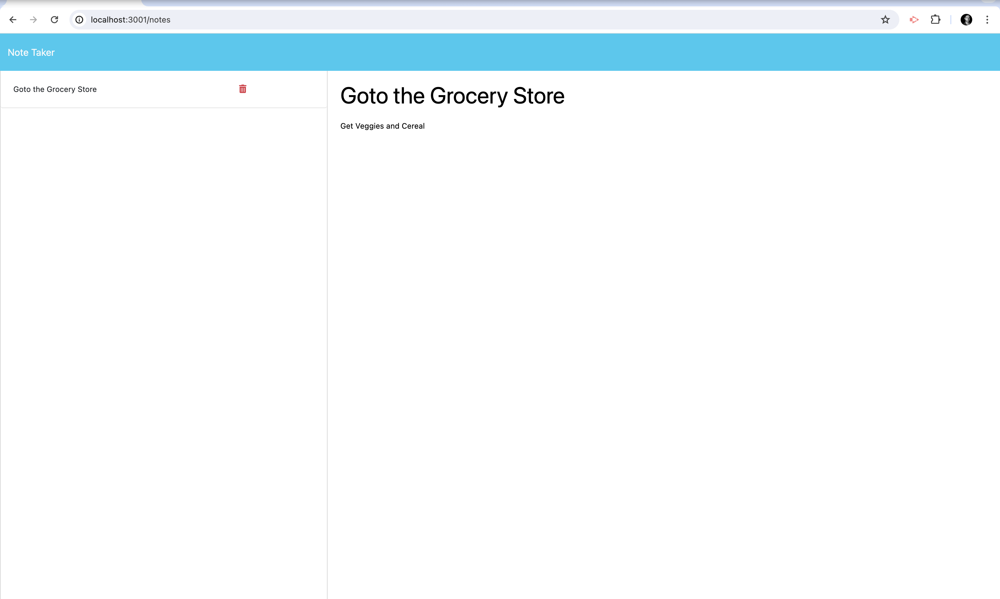
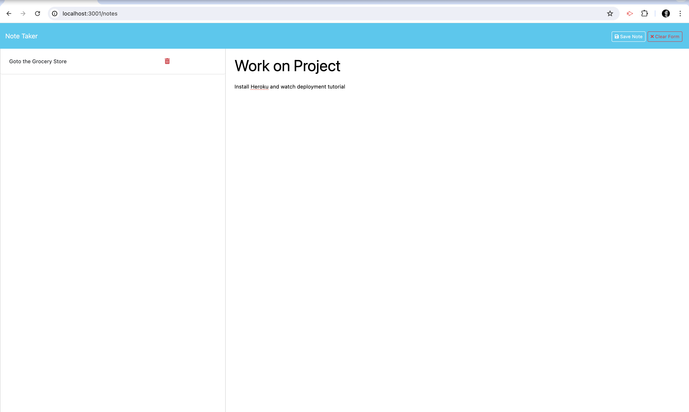

# Note Taker Application

## Description

This application, Note Taker, allows users to write, save, and delete notes. It utilizes an Express.js back end and saves note data to a JSON file, facilitating the organization of thoughts and tracking of tasks. The front end of the application was provided as starter code, with the back end developed and integrated to complete the application's functionality. This application is deployed on Heroku, making it easily accessible.

## Table of Contents

- [Installation](#installation)
- [Usage](#usage)
- [Screenshots](#screenshots)
- [Credits](#credits)
- [License](#license)

## Installation

To install the application locally, follow these steps:

1. Clone the repository to your local machine.
2. Run `npm install` to install all necessary dependencies.
3. Start the server using `npm start` or `node server.js`.
4. Access the application by navigating to `http://localhost:3001` in your browser.

## Usage

Upon launching the Note Taker application, users are presented with a landing page with a link to the notes page. Here, users can view existing notes, add new notes, and delete notes as needed. Each note requires a title and text content, which can be saved using the "Save Note" button. Users can view any note by clicking on it in the list displayed on the left-hand side of the page.

## Screenshots

Add screenshots of your application in action here. Replace `path/to/screenshot.png` with the actual file path to your screenshot images.

## Credits

- Mark Barrie: Backend Development
- Starter Code: [Add link here](#)

## License

This project is open source and available under the [MIT License](LICENSE).

